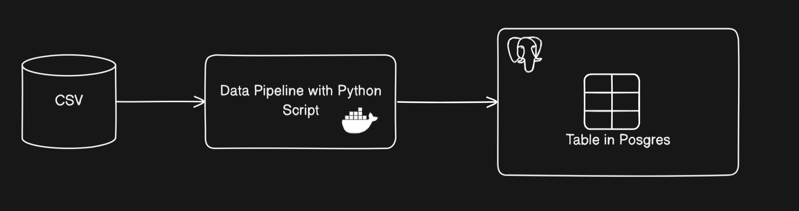
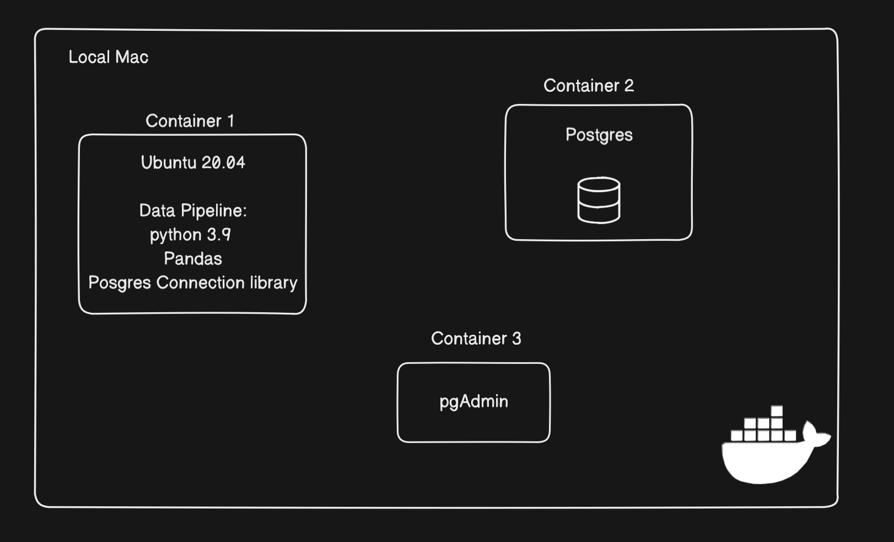
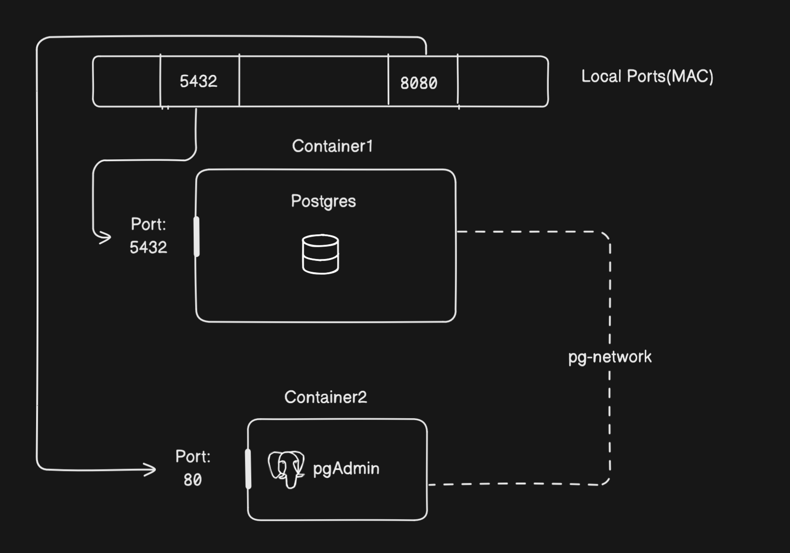
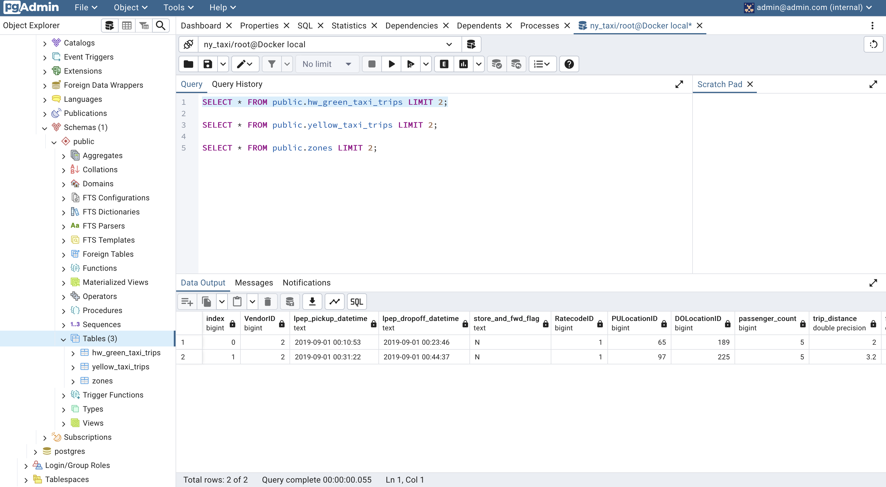

# Module 1: Containerization and Infrastructure as Code

## Table of Contents
* Docker and docker-compose 
* Running Postgres locally with Docker
* Setting up infrastructure on GCP with Terraform

#### Datapipeline Overview

Create a basic data pipeline to import CSV/Parquet files into a locally managed PostgreSQL instance using Docker.

Pipeline Overview is shown below:


The Docker architecture to be implemented is outlined below:


#### Project Folder

Make sure we are in Module1
```bash
cd module1
```

#### Persist Data

First, we will create directories to store persistent data for the PostgreSQL database and the PGAdmin server.
```bash
mkdir ny_taxi_postgres_data


mkdir data_pgadmin
chmod 777 data_pgadmin # In Macos, Change Permission
```
These directories will ensure that data remains persistent across container restarts.


#### Setup Postgres with Docker

We are going to setup two services: ```pgdatabase```, which uses the ```postgres:13``` image to run a PostgreSQL instance with a root user and password, and ```pgadmin```, which runs the pgAdmin web interface for managing PostgreSQL. Data for both services is persisted using local directories (```ny_taxi_postgres_data``` for the database and ```data_pgadmin``` for pgAdmin). The services communicate over a shared network called ```pg-network```, and the PostgreSQL database is exposed on port ```5432```, while pgAdmin is accessible via port ```8080```.


Filename: docker-compose.yml
```yml
version: '3'

services:
  pgdatabase:
    image: postgres:13
    environment:
      - POSTGRES_USER=root
      - POSTGRES_PASSWORD=root
      - POSTGRES_DB=ny_taxi
    volumes:
      - "./ny_taxi_postgres_data:/var/lib/postgresql/data:rw"
    ports:
      - "5432:5432"
    networks:
      - pg-network

  pgadmin:
    image: dpage/pgadmin4
    volumes:
      - ./data_pgadmin:/var/lib/pgadmin
    environment:
      - PGADMIN_DEFAULT_EMAIL=admin@admin.com
      - PGADMIN_DEFAULT_PASSWORD=root
    ports:
      - "8080:80"
    networks:
      - pg-network

networks:
  pg-network:
    name: pg-network
```

Lets Start the main postgres service defined above:

```bash
docker-compose -p main up -d

>>>
[+] Running 32/2
 ✔ pgadmin 16 layers [⣿⣿⣿⣿⣿⣿⣿⣿⣿⣿⣿⣿⣿⣿⣿⣿]      0B/0B      Pulled                                                             16.7s 
 ✔ pgdatabase 14 layers [⣿⣿⣿⣿⣿⣿⣿⣿⣿⣿⣿⣿⣿⣿]      0B/0B      Pulled                                                            11.3s 
[+] Running 3/3
 ✔ Network pg-network           Created                                                                                     0.0s 
 ✔ Container main-pgadmin-1     Started                                                                                     0.5s 
 ✔ Container main-pgdatabase-1  Started   
```

To stop and remove all resources created by the Docker Compose setup, run the following command:
```
docker-compose -p main down
```

#### Create a Ingestion Script
You can find the ingestion script here:
[ingest_data.py](ingest_data.py)

#### Container for Python Data Ingestion

Filename: Dockerfile
```Dockerfile
FROM python:3.9.1  
RUN pip install pandas typer sqlalchemy psycopg2 pyarrow

WORKDIR /app

COPY ingest_data.py ingest_data.py

ENTRYPOINT [ "python", "ingest_data.py"]
```

Filename: docker-compose.ingest.yml
```yml
version: '3'

services:
  ingest_data:
    build:
      context: .
      dockerfile: Dockerfile
    environment:
      - USER=root
      - PASSWORD=root
      - HOST=pgdatabase
      - PORT=5432
      - DB=ny_taxi
      - TB=${TB}
      - URL=${URL}
    command: ["--tb", "${TABLE_NAME}", "--url", "${URL}"]
    networks:
      - pg-network

networks:
  pg-network:
    external: true
    name: pg-network
```

The ingestion script requires two parameters: ```table_name``` and ```url```. You can provide these parameters in three ways:
1. In  `.env` file:
    
    ```
    TABLE_NAME=your_table_name
    URL=your_url
    
    ```
    
2. As environment variables when running Docker Compose:
    
    ```bash
    TABLE_NAME=your_table_name URL=your_data_url docker-compose -f docker-compose.ingest.yml up --build
    ```
    
3. Directly in the Docker Compose command:
    
    ```bash
    docker-compose -f docker-compose.ingest.yml run --rm ingest_data \
    --table_name your_table_name \
    --url your_data_url
    ``` 

Using third option to load multiple dataset:

```
# Zone Yellow Taxi
docker-compose -f docker-compose.ingest.yml run --rm ingest_data \
    --table-name zones \
    --url https://d37ci6vzurychx.cloudfront.net/misc/taxi_zone_lookup.csv

# Yellow Taxi Trips Data
docker-compose -f docker-compose.ingest.yml run --rm ingest_data \
    --table-name yellow_taxi_trips \
    --url https://d37ci6vzurychx.cloudfront.net/trip-data/yellow_tripdata_2024-01.parquet

# Homework - Green Taxi Data
docker-compose -f docker-compose.ingest.yml run --rm ingest_data \
    --table-name hw_green_taxi_trips \
    --url https://github.com/DataTalksClub/nyc-tlc-data/releases/download/green/green_tripdata_2019-09.csv.gz
```

Result:



#### Infastructure as a Code(Google Cloud)
You can manage your infrastructure using Terraform. Here’s a sample Terraform configuration:
[main.tf](main.tf)


Filename: variables.tf(Template only, needed)
```terraform
variable "credentials" {
  description = "My Credentials"
  default     = "path/to/secvice_acc_keys.json"
}

variable "project" {
  description = "Project"
  default     = "<projid>"
}

variable "region" {
  description = "Region"
  default     = "us-central1"
}

variable "location" {
  description = "Project Location"
  default     = "US"
}

variable "bq_dataset_name" {
  description = "My BigQuery Dataset Name"
  default     = "demo_dataset"
}

variable "gcs_bucket_name" {
  description = "My Storage Bucket Name"
  default     = "<bucketid>"
}

variable "gcs_storage_class" {
  description = "Bucket Storage Class"
  default     = "STANDARD"
}
```