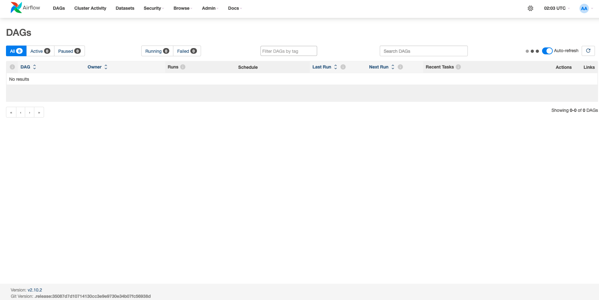
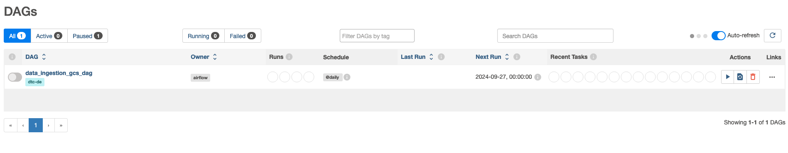
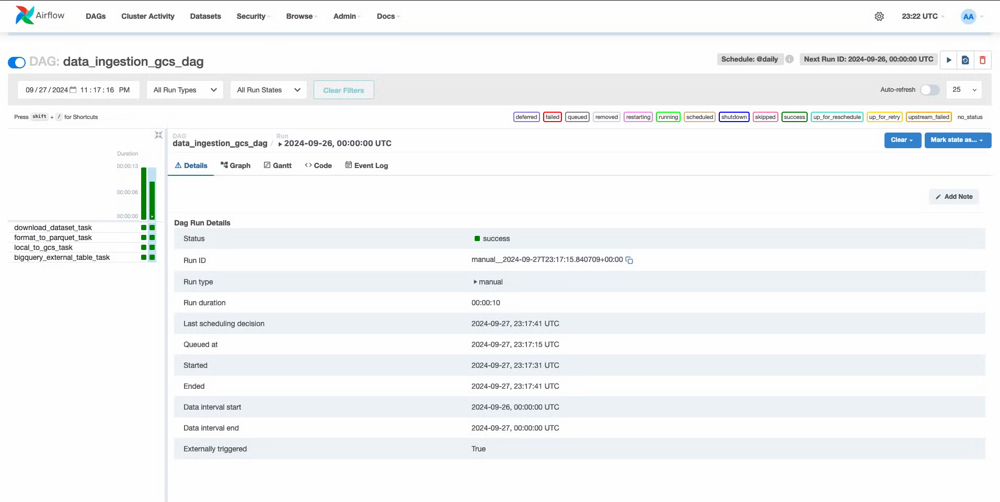
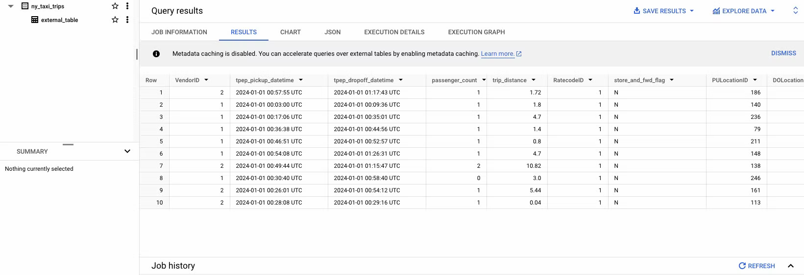

# Workflow Orchestration with Airflow
## Table of Contents
* Data Ingestion to GCP using Airflow
#### Resourses 

[Airflow with Docker Offical Documentation](https://airflow.apache.org/docs/apache-airflow/stable/howto/docker-compose/index.html)

[GCP Integration with Docker Official Documentation](https://airflow.apache.org/docs/docker-stack/recipes.html)

#### Project Folder

Make sure we are in Module2
```bash
mkdir -p module2/airflow && cd $_
```

### Data Ingestion to GCP using Airflow

#### Fetch docker-compose.yml
To deploy Airflow on Docker Compose, you should fetch [docker-compose.yml](https://airflow.apache.org/docs/apache-airflow/2.10.2/docker-compose.yaml)
```bash
curl -LfO 'https://airflow.apache.org/docs/apache-airflow/2.10.2/docker-compose.yaml'
```
<details>
  <summary>Click to show docker-compose.yml's details</summary>
This file contains several service definitions:

- `airflow-scheduler` - The [scheduler](https://airflow.apache.org/docs/apache-airflow/stable/administration-and-deployment/scheduler.html) monitors all tasks and DAGs, then triggers the
task instances once their dependencies are complete.
- `airflow-webserver` - The webserver is available at `http://localhost:8080`.
- `airflow-worker` - The worker that executes the tasks given by the scheduler.
- `airflow-triggerer` - The triggerer runs an event loop for deferrable tasks.
- `airflow-init` - The initialization service.
- `postgres` - The database.
- `redis` - [The redis](https://redis.io/) - broker that forwards messages from scheduler to worker.

Optionally, you can enable flower by adding `--profile flower` option, e.g. `docker compose --profile flower up`, or by explicitly specifying it on the command line e.g. `docker compose up flower`.

- `flower` - [The flower app](https://flower.readthedocs.io/en/latest/) for monitoring the environment. It is available at `http://localhost:5555`.

All these services allow you to run Airflow with [CeleryExecutor](https://airflow.apache.org/docs/apache-airflow-providers-celery/stable/celery_executor.html). For more information, see [Architecture Overview](https://airflow.apache.org/docs/apache-airflow/stable/core-concepts/overview.html).

Some directories in the container are mounted, which means that their
 contents are synchronized between your computer and the container.

- `./dags` - you can put your DAG files here.
- `./logs` - contains logs from task execution and scheduler.
- `./config` - you can add custom log parser or add `airflow_local_settings.py` to configure cluster policy.
- `./plugins` - you can put your [custom plugins](https://airflow.apache.org/docs/apache-airflow/stable/authoring-and-scheduling/plugins.html) here.

This file uses the latest Airflow image ([apache/airflow](https://hub.docker.com/r/apache/airflow)).
If you need to install a new Python library or system library, you can [build your image](https://airflow.apache.org/docs/docker-stack/index.html).
</details>

#### Setting the right Airflow user
On Linux, the quick-start needs to know your host user id and needs to have group id set to 0.
Otherwise the files created in dags, logs and plugins will be created with root user ownership.
You have to make sure to configure them for the docker-compose:

```bash
mkdir -p ./dags ./logs ./plugins ./config
echo -e "AIRFLOW_UID=$(id -u)" > .env
```

#### Update docker-compose.yml for gcp integration:

[see docker-compose.yaml](docker-compose.yaml)

NOTE: Need to add GCP_PROJECT_ID and GCP_GCS_BUCKET to the ```.env``` file.

The changes to original are:
```
  build:
    context: .
    dockerfile: ./Dockerfile

 AIRFLOW__CORE__LOAD_EXAMPLES: 'false'

GOOGLE_APPLICATION_CREDENTIALS: /.google/credentials/google_credentials.json

AIRFLOW_CONN_GOOGLE_CLOUD_DEFAULT: 'google-cloud-platform://?extra__google_cloud_platform__key_path=/.google/credentials/google_credentials.json'


GCP_PROJECT_ID: ''
GCP_GCS_BUCKET: ''


- ~/.google/credentials/:/.google/credentials:ro
```

#### Create Docker file for gcp integration:
[see docker-compose.yaml](Dockerfile)

#### Initialize the database

On **all operating systems**, you need to run database migrations and create the first user account. To do this, run.

```bash
docker compose up airflow-init
```

#### Running Airflow

Now you can start all services:

```bash
docker compose up
```
Go to Airflow UI: http://0.0.0.0:8080 

UserName: airflow

Password: airflow



#### Standup the Resources in GCP using Terraform 
[see main.tf](main.tf)

[see template_variables.tf](temp/template_variables.tf)

Note: Remove template_ after entering right info and move it back to Module2 folder

```
terraform init
terraform plan
terraform apply
```
NOTE: ```terraform destroy``` to destory the resourses 

#### Create and run a DAG

Create a file called data_ingestion_gcs_dag.py in module2/airflow/dags

[see data_ingestion_gcs_dag.py](airflow/dags/data_ingestion_gcs_dag.py)



Click on the DAG and hit run at top right run button to start


Data Querried in GCP's BigQuerry after sucessfull run. 



#### Cleaning-up the environment

Maake sure to stop the running airflow with cntrl+C
and,

```
docker compose down --volumes --remove-orphans


# To stop and delete containers, delete volumes with database data and download images, run:
docker compose down --volumes --rmi all
```

Delete Cloud Resourses:

Note: First delete the ny_taxi_data from BigQuery.

```
terraform destroy
```


