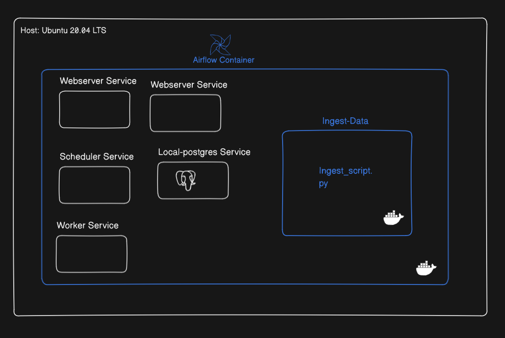

## Setup Local Ingestion 

Ref used for trouble shooting DinD: https://stackoverflow.com/questions/69316093/how-to-add-new-user-to-docker-image-when-running-distributed-airflow-architectur


### Overview Diagram 




### Execution code

Install ```docker``` and ```docker``` composein Host:
```
# Add Docker's official GPG key:
sudo apt-get update
sudo apt-get install ca-certificates curl
sudo install -m 0755 -d /etc/apt/keyrings
sudo curl -fsSL https://download.docker.com/linux/ubuntu/gpg -o /etc/apt/keyrings/docker.asc
sudo chmod a+r /etc/apt/keyrings/docker.asc

# Add the repository to Apt sources:
echo \
  "deb [arch=$(dpkg --print-architecture) signed-by=/etc/apt/keyrings/docker.asc] https://download.docker.com/linux/ubuntu \
  $(. /etc/os-release && echo "$VERSION_CODENAME") stable" | \
  sudo tee /etc/apt/sources.list.d/docker.list > /dev/null
sudo apt-get update


sudo apt-get install docker-ce docker-ce-cli containerd.io docker-buildx-plugin docker-compose-plugin

sudo docker run hello-world
```

Add user to docker group:
```
sudo groupadd docker
sudo usermod -aG docker $USER
newgrp docker
```

Run airflow:
```
mkdir -p ./dags ./logs ./plugins ./config ./data
echo -e "AIRFLOW_UID=$(id -u)\nAIRFLOW_GID=$(getent group docker | cut -d: -f3)" > .env
# NOte: add another .env variables also, see below for instruction


docker compose up airflow-init
docker compose up -d


# Clean
docker compose down --volumes --remove-orphans
docker compose down --volumes --rmi all
```

### Host Machine
- OS: Ubuntu 20.04 LTS
- Docker: Installed and configured with Docker daemon running.
- User Configuration:
    -  User ```myuser``` is added to the ```docker group``` to allow Docker commands without sudo.
    - A local directory /data exists with ```HOST_DATA_PATH``` on the host machine, which will be used to persist the downloaded data.

### Environment Variable

The following environment variables are set to manage permissions and paths:
- ```AIRFLOW_UID```: The UID of myuser, ensuring Airflow services run with the appropriate user permissions.

- ```AIRFLOW_GID```: The GID of the docker group, allowing access to Docker from within the Airflow container.

- ```HOST_DATA_PATH```: Path to the data directory on the host machine (/data), mounted inside both the Airflow and Ingest-Data containers.

Example .env
```bash
AIRFLOW_UID=<uid of myuser>
AIRFLOW_GID=<gid of of docker group> 
HOST_DATA_PATH=/full/path/to/data/in/host
```

### Data Flow and Persistence

#### Data Storage:
- A local folder /data on the host machine is mounted inside the Airflow container at /opt/airflow/data to ensure data persistence.
```bash
volumes:
    ${AIRFLOW_PROJ_DIR:-.}/data:/opt/airflow/data
```
- The Ingest-Data container, created by the DockerOperator, also mounts this data folder to ensure the downloaded data is accessible across both containers.
```bash
mounts=[Mount(
            target=f'/app/data', # Ingest-Data Container path
            source=HOST_DATA_PATH, # Data path in host 
            type='bind' 
        )],
```

#### Data Flow:
- A file is downloaded by the Airflow worker during the ```curl_task``` to ```/opt/airflow/data```.
- The file is synchronized with the host machine's ```HOST_DATA_PATH``` directory, which is also mounted inside the Ingest-Data container ```app/data```.
- The Ingest-Container then execute ```ingest_script.py``` to load the data into ```local-postgres``` db.

### Airflow Container Setup

#### Services

The Airflow container is configured with the following services:

Defaults:
- Webserver: The Airflow web interface, enabling monitoring and interaction with the DAGs.

- Scheduler: Responsible for executing tasks in the DAGs.

- Worker: Processes the tasks defined in the DAGs.

- Postgres: The metadata database for Airflow.

Additional Services:

- Local Postgres:

    -  An internal Postgres instance running within the same Airflow container but separate from the Airflow metadata Postgres.
    - Used for specific task data storage or further processing requirements by the pipeline.
- Ingest-Data Service:

    - A service built using the custom ingest-data image, designed to process and ingest data.
    - The image is built and run within the Airflow container and triggered via the DockerOperator.

#### Docker-in-Docker (DinD) Configuration

The system uses ```Docker-in-Docker (DinD)``` to enable the Airflow container to manage additional Docker containers via the DockerOperator.
The host's docker.sock is mounted inside the Airflow container to allow this:
```
volumes:
    /var/run/docker.sock:/var/run/docker.sock
```
The DockerOperator communicates with the Docker daemon using ```unix:///var/run/docker.sock.```:

```
ingest_task = DockerOperator(
        ...
        docker_url='unix://var/run/docker.sock',
        ...
    )
```
Note:

need to add group in docker-compose.yaml as only '0' which is root allowed by airflow. Need to add docker group(AIRFLOW_GID). 
```
group_add:
      - ${AIRFLOW_GID} 
```

Two more env variables for docker-compose.yaml
```
AIRFLOW__CORE__ENABLE_XCOM_PICKLING: "True" 
HOST_DATA_PATH: ${HOST_DATA_PATH}
```

Also changed premission of folder used for airflow and data during initialization( ```airflow-init``` sevice):
```
mkdir -p /sources/logs /sources/dags /sources/plugins /sources/data /sources/config
        chown -R "${AIRFLOW_UID}:${AIRFLOW_GID}" /sources/{logs,dags,plugins,data,config}
```
#### DAG Configuration

The DAG contains two main tasks:

- ```curl_task```: 
A BashOperator task that downloads data using curl and stores it in /opt/airflow/data (mapped to the host’s HOST_DATA_PATH directory).
        
- ```ingest_task```: A DockerOperator task that triggers the Ingest-Data container, mounting the shared /data directory to process the downloaded data.

Task Flow:

First, the curl_task downloads data to the shared opt/airflow/data(which is synced to HOST_DATA_PATH) folder.
Then, the ingest_task uses the Ingest-Data container to load the data into local-postgres db. 

