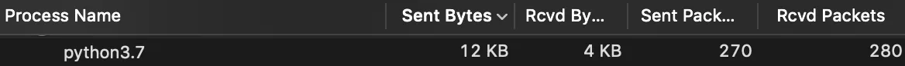

# Pyspark

[https://medium.com/analytics-vidhya/how-does-pyspark-work-step-by-step-with-pictures-c011402ccd57](https://medium.com/analytics-vidhya/how-does-pyspark-work-step-by-step-with-pictures-c011402ccd57)

## Background: Working of Pyspark from source above

### Wait, how does PySpark talk to the Java process?

PySpark is able to make stuff happen inside a JVM process thanks to a Python 
library called Py4J (as in: “Python for Java”). Py4J allows Python 
programmes to:

- open up a port to listen on (25334)
- start up a JVM programme
- make the JVM programme listen on a different network port (25333)
- send commands to the Java process and listen for responses

eg: 

```bash
some_string = spark.sparkContext.parallelize("hello hello hello") #1
some_string.take(5)
```

#1 would show nothing in UI: 

A lot of RDD operations are lazy — that’s part of the design of Spark. They will not execute unless you call an *action* operation on the RDD (i.e. you ask Spark to give you a result).

So what happened to your data in this simple example?

**Python**:

```
Serialize "hello hello hello" -> temporary file
Tell JVM (via Py4J) to pick up the file and create a Java RDD ("parallelize" the data)
Create a Python variable to store information about the Java RDD
```

**JVM**

```
Read the temporary file into a collection of (byte) arrays

Create a Java RDD object from this collection (partitions and distributes the data in memory - this is the point of the parallelize operation)Tell Python where to find the object in the JVM
```

**Python**

```
Ask JVM for the first 5 records from the data stored in Spark's memory
```

**JVM**

```
Return results via Py4J
```

**Python**

```
Unpickle incoming data into a string
Display result
['h', 'e', 'l', 'l', 'o']
```

In this simple case, Spark didn’t do much anything useful — it simply took
the serialized data from Python, chopped it up into partitions and 
stored them in its own (distributed) memory.

How does the JVM know how to execute Python code, like `.upper()`, on a string? Does Spark map all the functions in the Python language to the equivalent functions in Scala/Java?

It doesn’t. [**Spark creates Python worker processes to execute Python functions.**](https://github.com/apache/spark/blob/7dff3b125de23a4d6ce834217ee08973b259414c/core/src/main/scala/org/apache/spark/SparkEnv.scala#L75)

EG:

```bash
something = 'hello ' * 1000000
another_string = spark.sparkContext.parallelize(something)

another_string.map(lambda a: a.upper()).take(100)
```




You can see the JVM sending out a large file. This is the input data being sent to the Spark cluster to be parallelized (i.e. to live in Spark workers’ memory).

Interestingly, you can see new Python processes being created (these are the Python workers we mentioned earlier):


Each of those PySpark processes unpickles the data and the code they received from Spark. They execute the `.upper()`
 function on the data, and then serialize the results again into the 
Pickle format. The serialized data is passed back into Spark and stored 
in Spark workers’ memory.

Finally, Spark sends the result (1kb large) back to our original PySpark process.


PySpark then deserializes the results and prints out a Python array for you.

## Creating a spark session:

```bash
spark = SparkSession.builder \
    .master("local[*]") \
    .appName('test') \
    .getOrCreate()
```

The entry point to programming Spark with the Dataset and DataFrame API.

A SparkSession can be used to create [`DataFrame`](https://spark.apache.org/docs/3.5.3/api/python/reference/pyspark.sql/api/pyspark.sql.DataFrame.html#pyspark.sql.DataFrame), register [`DataFrame`](https://spark.apache.org/docs/3.5.3/api/python/reference/pyspark.sql/api/pyspark.sql.DataFrame.html#pyspark.sql.DataFrame) as
tables, execute SQL over tables, cache tables, and read parquet files.
Note: UI also lauches after executing this command and see jobs(no jobs yet) 

Read CSV:

```bash
df = spark.read \
    .option("header", "true") \
    .csv('fhvhv_tripdata_2021-01.csv')
```

Print Schema:

```bash
df.schema
>>> StructType(List(StructField(hvfhs_license_num,StringType,true),
StructField(dispatching_base_num,StringType,true)
,StructField(pickup_datetime,StringType,true)
,StructField(dropoff_datetime,StringType,true)
,StructField(PULocationID,StringType,true)
,StructField(DOLocationID,StringType,true)
,StructField(SR_Flag,StringType,true)))
```

Just look at and few rows(head):

```bash
!head -n 101 fhvhv_tripdata_2021-01.csv > head.csv

df_pandas = pd.read_csv('head.csv')

df_pandas.dtypes
```

Read with proper schema:

```bash
from pyspark.sql import types

schema = types.StructType([
    types.StructField('hvfhs_license_num', types.StringType(), True),
    types.StructField('dispatching_base_num', types.StringType(), True),
    types.StructField('pickup_datetime', types.TimestampType(), True),
    types.StructField('dropoff_datetime', types.TimestampType(), True),
    types.StructField('PULocationID', types.IntegerType(), True),
    types.StructField('DOLocationID', types.IntegerType(), True),
    types.StructField('SR_Flag', types.StringType(), True)
])

df = spark.read \
    .option("header", "true") \
    .schema(schema) \
    .csv('head.csv')
```

Partition the data and write to parquet:

```bash
df = df.repartition(24)

df.write.parquet('fhvhv/2021/01/')
```

Read parquet:

```bash
df = spark.read.parquet('fhvhv/2021/01/')
df.printSchema() # Print schema
```


```bash
# Nothing happens, lazy execution
df.select('pickup_datetime', 'dropoff_datetime', 'PULocationID', 'DOLocationID') \
  .filter(df.hvfhs_license_num == 'HV0003')
```

```bash
# Action show() makes the transformation eager
df.select('pickup_datetime', 'dropoff_datetime', 'PULocationID', 'DOLocationID') \
  .filter(df.hvfhs_license_num == 'HV0003').show()
```


[https://pub.aimind.so/pyspark-everything-you-need-to-know-24f87d12bfe1](https://pub.aimind.so/pyspark-everything-you-need-to-know-24f87d12bfe1)

Spark Architecture: 


Transformation vs Action:


Transformation(Lazy execution): build a logical execution plan, which Spark optimizes before execution. Transformations are only executed when an action is triggered, allowing Spark to optimize the data processing.

eg:

filter() , map() , select(), join(), groupby()

Action: When an action is called, Spark executes all the preceding transformations in a single optimized execution plan. Actions are what drive the computation, making Spark go through the dataset and produce output.

**Examples of actions:**

- **`collect()`**: Retrieves all data from the distributed environment back to the driver.
- **`count()`**: Counts the number of rows in the DataFrame or RDD.
- **`show()`**: Displays a specified number of rows in the console.
- **`write()`**: Writes the DataFrame to storage, like a file or database.

Sql Functions:

```bash
df \
    .withColumn('pickup_date', F.to_date(df.pickup_datetime)) \
    .withColumn('dropoff_date', F.to_date(df.dropoff_datetime)) \
    .select('pickup_date', 'dropoff_date', 'PULocationID', 'DOLocationID') \
    .show()
```

Define your own custom sql function(udf):

```bash
def crazy_stuff(base_num):
    num = int(base_num[1:])
    if num % 7 == 0:
        return f's/{num:03x}'
    elif num % 3 == 0:
        return f'a/{num:03x}'
    else:
        return f'e/{num:03x}'

# test 
crazy_stuff('B02884')

crazy_stuff_udf = F.udf(crazy_stuff, returnType=types.StringType())

df \
    .withColumn('pickup_date', F.to_date(df.pickup_datetime)) \
    .withColumn('dropoff_date', F.to_date(df.dropoff_datetime)) \
    .withColumn('base_id', crazy_stuff_udf(df.dispatching_base_num)) \
    .select('base_id', 'pickup_date', 'dropoff_date', 'PULocationID', 'DOLocationID') \
    .show()

```

### Download taxi data script:

```bash
set -e # stop execution on error 404, data not availabel for months > 8

TAXI_TYPE=$1 # "yellow"
YEAR=$2 # 2021

URL_PREFIX="https://github.com/DataTalksClub/nyc-tlc-data/releases/download"

for MONTH in {1..12}; do
  FMONTH=`printf "%02d" ${MONTH}`

  URL="${URL_PREFIX}/${TAXI_TYPE}/${TAXI_TYPE}_tripdata_${YEAR}-${FMONTH}.csv.gz"

  LOCAL_PREFIX="data/raw/${TAXI_TYPE}/${YEAR}/${FMONTH}"
  LOCAL_FILE="${TAXI_TYPE}_tripdata_${YEAR}_${FMONTH}.csv.gz"
  LOCAL_PATH="${LOCAL_PREFIX}/${LOCAL_FILE}"

  echo "downloading ${URL} to ${LOCAL_PATH}"
  mkdir -p ${LOCAL_PREFIX}
  wget ${URL} -O ${LOCAL_PATH}

done
```

View the data using:

```bash
# zcat similar to cat but gzip files
zcat data/raw/yellow/2021/01/yello_tripdata_2021_01.csv.gz | head -n 10 
zcat data/raw/yellow/2021/01/yello_tripdata_2021_01.csv.gz | wc -l

sudo apt-get install tree

tree data  
```

Convert to parquet

```bash
spark = SparkSession.builder \
    .master("local[*]") \
    .appName('test') \
    .getOrCreate()

green_schema = types.StructType([
    types.StructField("VendorID", types.IntegerType(), True),
    types.StructField("lpep_pickup_datetime", types.TimestampType(), True),
    types.StructField("lpep_dropoff_datetime", types.TimestampType(), True),
    types.StructField("store_and_fwd_flag", types.StringType(), True),
    types.StructField("RatecodeID", types.IntegerType(), True),
    types.StructField("PULocationID", types.IntegerType(), True),
    types.StructField("DOLocationID", types.IntegerType(), True),
    types.StructField("passenger_count", types.IntegerType(), True),
    types.StructField("trip_distance", types.DoubleType(), True),
    types.StructField("fare_amount", types.DoubleType(), True),
    types.StructField("extra", types.DoubleType(), True),
    types.StructField("mta_tax", types.DoubleType(), True),
    types.StructField("tip_amount", types.DoubleType(), True),
    types.StructField("tolls_amount", types.DoubleType(), True),
    types.StructField("ehail_fee", types.DoubleType(), True),
    types.StructField("improvement_surcharge", types.DoubleType(), True),
    types.StructField("total_amount", types.DoubleType(), True),
    types.StructField("payment_type", types.IntegerType(), True),
    types.StructField("trip_type", types.IntegerType(), True),
    types.StructField("congestion_surcharge", types.DoubleType(), True)
])

yellow_schema = types.StructType([
    types.StructField("VendorID", types.IntegerType(), True),
    types.StructField("tpep_pickup_datetime", types.TimestampType(), True),
    types.StructField("tpep_dropoff_datetime", types.TimestampType(), True),
    types.StructField("passenger_count", types.IntegerType(), True),
    types.StructField("trip_distance", types.DoubleType(), True),
    types.StructField("RatecodeID", types.IntegerType(), True),
    types.StructField("store_and_fwd_flag", types.StringType(), True),
    types.StructField("PULocationID", types.IntegerType(), True),
    types.StructField("DOLocationID", types.IntegerType(), True),
    types.StructField("payment_type", types.IntegerType(), True),
    types.StructField("fare_amount", types.DoubleType(), True),
    types.StructField("extra", types.DoubleType(), True),
    types.StructField("mta_tax", types.DoubleType(), True),
    types.StructField("tip_amount", types.DoubleType(), True),
    types.StructField("tolls_amount", types.DoubleType(), True),
    types.StructField("improvement_surcharge", types.DoubleType(), True),
    types.StructField("total_amount", types.DoubleType(), True),
    types.StructField("congestion_surcharge", types.DoubleType(), True)
])

def write_to_parquet(taxi_color: str,year: int) -> None:
    """
    taxi_color = 'yellow' or 'green'
    """
    for month in range(1, 13):
        print(f'processing data for {year}/{month}')
    
        input_path = f'data/raw/taxi_color/{year}/{month:02d}/'
        output_path = f'data/pq/taxi_color/{year}/{month:02d}/'
        schema_req = green_schema if taxi_color == "green" else yellow_schema
        df_green = spark.read \
            .option("header", "true") \
            .schema(schema_req) \
            .csv(input_path)
    
        df_green \
            .repartition(4) \
            .write.parquet(output_path)
            
 
 comb_input = [('yellow', 2020), ('yellow', 2021),('green', 2020), ('green', 2021)]
 map(lambda x: write_to_parquet(*x), comb_input)
```

```bash
import pyspark
from pyspark.sql import SparkSession

spark = SparkSession.builder \
    .master("local[*]") \
    .appName('test') \
    .getOrCreate()

# Read all parquet files
df_green = spark.read.parquet('data/pq/green/*/*')
df_yellow = spark.read.parquet('data/pq/yellow/*/*')

# Union yellow and green, but make sure columns are same(order also same)
df_green = df_green \
    .withColumnRenamed('lpep_pickup_datetime', 'pickup_datetime') \
    .withColumnRenamed('lpep_dropoff_datetime', 'dropoff_datetime')
df_yellow = df_yellow \
    .withColumnRenamed('tpep_pickup_datetime', 'pickup_datetime') \
    .withColumnRenamed('tpep_dropoff_datetime', 'dropoff_datetime')
    
common_colums = []

yellow_columns = set(df_yellow.columns)

for col in df_green.columns:  
    if col in yellow_columns:
        common_colums.append(col)

from pyspark.sql import functions as F
df_green_sel = df_green \
    .select(common_colums) \
    .withColumn('service_type', F.lit('green'))

df_yellow_sel = df_yellow \
    .select(common_colums) \
    .withColumn('service_type', F.lit('yellow'))
    
df_trips_data = df_green_sel.unionAll(df_yellow_sel)
df_trips_data.groupBy('service_type').count().show()

# Convert to temp sql table
df_trips_data.registerTempTable('trips_data')

# SQL code
spark.sql("""
SELECT
    service_type,
    count(1)
FROM
    trips_data
GROUP BY 
    service_type
""").show()

df_result = spark.sql("""
SELECT 
    -- Reveneue grouping 
    PULocationID AS revenue_zone,
    date_trunc('month', pickup_datetime) AS revenue_month, 
    service_type, 

    -- Revenue calculation 
    SUM(fare_amount) AS revenue_monthly_fare,
    SUM(extra) AS revenue_monthly_extra,
    SUM(mta_tax) AS revenue_monthly_mta_tax,
    SUM(tip_amount) AS revenue_monthly_tip_amount,
    SUM(tolls_amount) AS revenue_monthly_tolls_amount,
    SUM(improvement_surcharge) AS revenue_monthly_improvement_surcharge,
    SUM(total_amount) AS revenue_monthly_total_amount,
    SUM(congestion_surcharge) AS revenue_monthly_congestion_surcharge,

    -- Additional calculations
    AVG(passenger_count) AS avg_montly_passenger_count,
    AVG(trip_distance) AS avg_montly_trip_distance
FROM
    trips_data
GROUP BY
    1, 2, 3
""")

df_result.show()
df_result.coalesce(1).write.parquet('data/report/revenue/', mode='overwrite')

```

## Groupby


```bash
import pyspark
from pyspark.sql import SparkSession

spark = SparkSession.builder \
    .master("local[*]") \
    .appName('test') \
    .getOrCreate()
    
    
df_green = spark.read.parquet('data/pq/green/*/*')
df_green.registerTempTable('green')

df_green_revenue = spark.sql("""
SELECT 
    date_trunc('hour', lpep_pickup_datetime) AS hour, 
    PULocationID AS zone,

    SUM(total_amount) AS amount,
    COUNT(1) AS number_records
FROM
    green
WHERE
    lpep_pickup_datetime >= '2020-01-01 00:00:00'
GROUP BY
    1, 2
""")

df_green_revenue \
    .repartition(20) \
    .write.parquet('data/report/revenue/green', mode='overwrite')

## SAME FOR yellow
df_yellow = spark.read.parquet('data/pq/yellow/*/*')
df_yellow.registerTempTable('yellow')

df_yellow_revenue = spark.sql("""
SELECT 
    date_trunc('hour', tpep_pickup_datetime) AS hour, 
    PULocationID AS zone,

    SUM(total_amount) AS amount,
    COUNT(1) AS number_records
FROM
    yellow
WHERE
    tpep_pickup_datetime >= '2020-01-01 00:00:00'
GROUP BY
    1, 2
""")

df_yellow_revenue \
    .repartition(20) \
    .write.parquet('data/report/revenue/yellow', mode='overwrite')
    
    

```

## Join:

Regular join does the groupby and mergesort for join. 

CONDITION: when one data is small while the other is large. Does boardcasting with executors maintianing the copy of say small data(zone) in this case.

A regular join in Spark performs a `groupBy` and `merge-sort` to combine datasets.

**Condition**: When one dataset is much smaller than the other, Spark can use **broadcast join**. In this case, Spark broadcasts (distributes) the smaller dataset across all executors, allowing each executor to have a local copy of the smaller dataset (e.g., a “zone” table). This significantly improves join efficiency by avoiding costly shuffles and enabling faster lookups.


```bash
df_green_revenue = spark.read.parquet('data/report/revenue/green')
df_yellow_revenue = spark.read.parquet('data/report/revenue/yellow')

df_green_revenue_tmp = df_green_revenue \
    .withColumnRenamed('amount', 'green_amount') \
    .withColumnRenamed('number_records', 'green_number_records')

df_yellow_revenue_tmp = df_yellow_revenue \
    .withColumnRenamed('amount', 'yellow_amount') \
    .withColumnRenamed('number_records', 'yellow_number_records')
    

df_join = df_green_revenue_tmp.join(df_yellow_revenue_tmp, 
					on=['hour', 'zone'], how='outer')
					
df_join.write.parquet('data/report/revenue/total', mode='overwrite')

df_join = spark.read.parquet('data/report/revenue/total')
df_zones = spark.read.parquet('zones/')
df_result = df_join.join(df_zones, df_join.zone == df_zones.LocationID)
df_result.drop('LocationID', 'zone').write.parquet('tmp/revenue-zones')
```

Raw RDDs for SQL querry:


```bash
SELECT 
    date_trunc('hour', lpep_pickup_datetime) AS hour, 
    PULocationID AS zone,

    SUM(total_amount) AS amount,
    COUNT(1) AS number_records
FROM
    green
WHERE
    lpep_pickup_datetime >= '2020-01-01 00:00:00'
GROUP BY
    1, 2
    
    
```

```bash
import pyspark
from pyspark.sql import SparkSession

spark = SparkSession.builder \
    .master("local[*]") \
    .appName('test') \
    .getOrCreate()
    
df_green = spark.read.parquet('data/pq/green/*/*')

rdd = df_green \
    .select('lpep_pickup_datetime', 'PULocationID', 'total_amount') \
    .rdd
    
from datetime import datetime
start = datetime(year=2020, month=1, day=1)

def filter_outliers(row):
    return row.lpep_pickup_datetime >= start

rows = rdd.take(10)
row = rows[0]

def prepare_for_grouping(row): 
    hour = row.lpep_pickup_datetime.replace(minute=0, second=0, microsecond=0)
    zone = row.PULocationID
    key = (hour, zone)
    
    amount = row.total_amount
    count = 1
    value = (amount, count)

    return (key, value)

def calculate_revenue(left_value, right_value):
    left_amount, left_count = left_value
    right_amount, right_count = right_value
    
    output_amount = left_amount + right_amount
    output_count = left_count + right_count
    
    return (output_amount, output_count)
    

from collections import namedtuple
RevenueRow = namedtuple('RevenueRow', ['hour', 'zone', 'revenue', 'count'])
def unwrap(row):
    return RevenueRow(
        hour=row[0][0], 
        zone=row[0][1],
        revenue=row[1][0],
        count=row[1][1]
    )
from pyspark.sql import types
result_schema = types.StructType([
    types.StructField('hour', types.TimestampType(), True),
    types.StructField('zone', types.IntegerType(), True),
    types.StructField('revenue', types.DoubleType(), True),
    types.StructField('count', types.IntegerType(), True)
])

df_result = rdd \
    .filter(filter_outliers) \
    .map(prepare_for_grouping) \
    .reduceByKey(calculate_revenue) \
    .map(unwrap) \
    .toDF(result_schema) 

df_result.write.parquet('tmp/green-revenue')

```

Raw RDD Map partition(Useful):


Allows us to apply map to a partition. 

```bash
columns = ['VendorID', 'lpep_pickup_datetime', 'PULocationID', 'DOLocationID', 'trip_distance']

duration_rdd = df_green \
    .select(columns) \
    .rdd

import pandas as pd
rows = duration_rdd.take(10)
df = pd.DataFrame(rows, columns=columns)

#model = ...

def model_predict(df):
#     y_pred = model.predict(df)
    y_pred = df.trip_distance * 5
    return y_pred
    
def apply_model_in_batch(rows):
    df = pd.DataFrame(rows, columns=columns)
    predictions = model_predict(df)
    df['predicted_duration'] = predictions

    for row in df.itertuples():
        yield row
        
        
 df_predicts = duration_rdd \
    .mapPartitions(apply_model_in_batch)\
    .toDF() \
    .drop('Index')
    
    
df_predicts.select('predicted_duration').show()
```